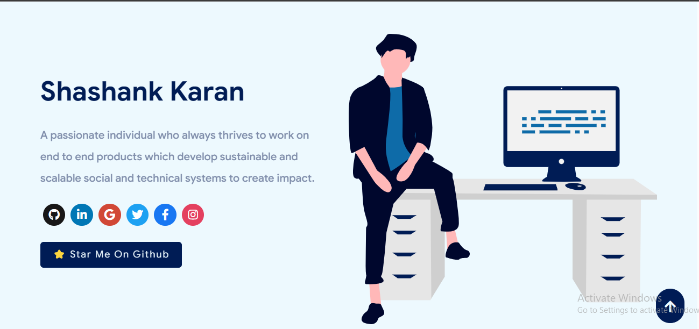

 
    </img>

<h1 align="center"> Software Developer Portfolio </h1> 
<h3 align="center"> A clean, beautiful, responsive portfolio   ! </h3>

  
  
  
  
  
  
   
  
  
  
  
  
  
  

 
    <a href="https://shashankkaran.github.io" target="_blank">
    </img>
  </a>

:star: Star us on GitHub — it helps!

# Sections 📚

✔️ Summary and About me\
✔️ Skills \
✔️ Open Source Projects Connected with Github\
✔️ Experience\
✔️ Certifications 🏆\
✔️ Blogs\
✔️ Education\
✔️ Contact me

To view a live example, **[click here](https://shashankkaran.github.io/)**

# Technologies used 🛠️

- [React](https://reactjs.org/)
- [graphql](https://graphql.org/)
- [apollo-boost](https://www.apollographql.com/docs/react/get-started/)
- [baseui](https://github.com/uber/baseweb)
- [react-reveal](https://www.react-reveal.com/)
- [styled-components](https://styled-components.com/)

# Contributing 💡

If you can help us with these. Please don't hesitate to open an [pull request](https://github.com/shashankkaran/portfolio/pulls) or [issue](https://github.com/shashankkaran/portfolio/issues).

- Add Podcast Section and Video Section
- Add tests to automate review.
- Setup Travis workflow.

# References 👏🏻

- Some Design and Implementation Ideas are taken from [Saad Pasta's Portfolio Project](https://github.com/saadpasta/developerFolio).
- The Logo of Portfolio is inspired from [prettier-logo](https://github.com/prettier/prettier-logo) for [prettier](https://github.com/prettier/prettier) designed by @ianstormtaylor.
